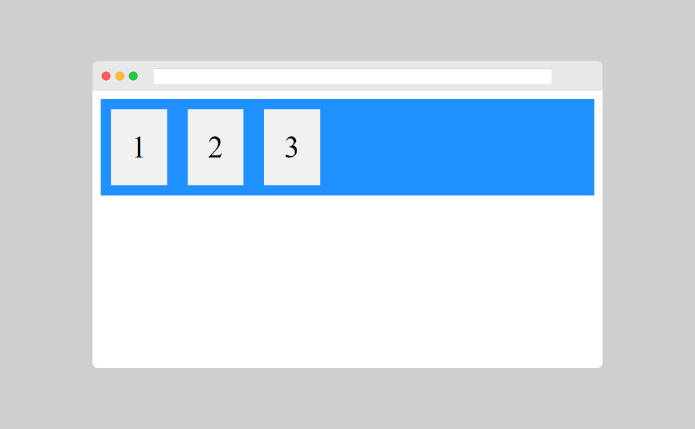

## ¿Qué es Flexbox?

Es un sistema de elementos flexibles. Donde los elementos HTML se adaptan y colocan automáticamente siendo mucho más fácil personalizar los diseños.

Está pensado para diseños en una sóla dimensión, es decir, o filas o columnas.

Antes de que existiese el Flexbox había otros modos de hacer layouts:

- Block
- Inline
- Table
- Position
  
El Flexbox hace que se más fácil crear estructuras de layout responsive, sin usar posicionamiento o flotantes.

### Flex container y Flex items

Para que flexbox funcione necesitamos tener un contenedor flex (flex container), el cual se crea con la propiedad de CSS display:flex; Este elemento padre debe contener a los elementos que serán las cajas flexibles, llamos elementos flex (o flex item).

### Ejemplo de flexbox

HTML:

    

        
1

        
2

        
3

    

CSS:

    .flex-container {
        display: flex;
        background-color: DodgerBlue;
    }

    .flex-container > div {
        background-color: #f1f1f1;
        margin: 10px;
        padding: 20px;
        font-size: 30px;
    }

